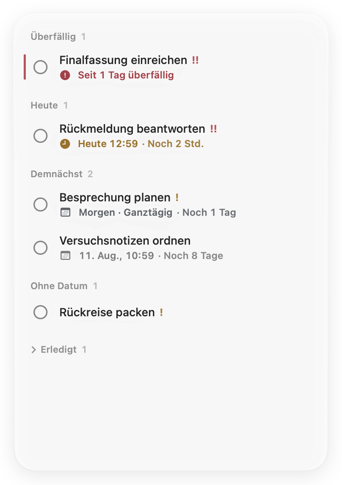
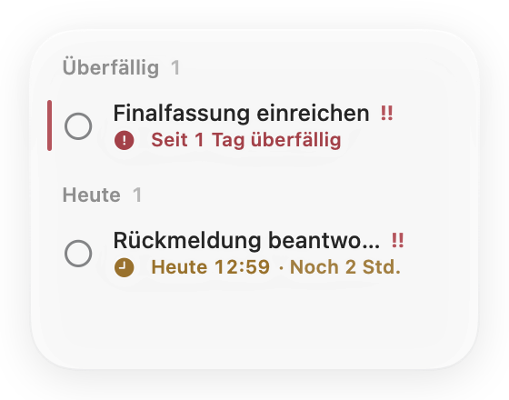
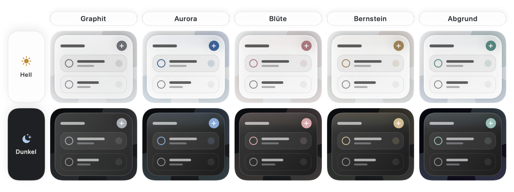

<p align="center">
  <a href="README.md">English</a> ·
  <a href="README.zh-Hans.md">简体中文</a> ·
  <a href="README.zh-Hant.md">繁體中文</a> ·
  <a href="README.ja.md">日本語</a> ·
  <a href="README.ko.md">한국어</a> ·
  <a href="README.fr.md">Français</a> ·
  <a href="README.es.md">Español</a> ·
  <a href="README.de.md">Deutsch</a>
</p>

<p align="center">
  
</p>

<h1 align="center">Jotted</h1>

<p align="center"><strong>Das Nächste – ruhig im Blick.</strong></p>

<p align="center">
  <a href="https://github.com/kaikaiyao/Jotted/releases/latest/download/Jotted-macOS.zip">
    
  </a>
</p>

<p align="center"><sub>Erfordert macOS 14 oder neuer · Apple-Chip und Intel · <a href="https://github.com/kaikaiyao/Jotted/releases">Alle Versionen</a></sub></p>

<p align="center">
  
</p>

Jotted ist ein leichtes, natives Aufgabenboard für macOS. Die neue, inhaltsorientierte Oberfläche verzichtet auf schwere Karten und zeigt nur, was beim Handeln hilft: Aufgaben, Fristen, Countdowns und zurückhaltende Statushinweise. Es bleibt unaufdringlich in einer Ecke des Schreibtischs und reduziert sich bei kleinerem Fenster automatisch auf das Wesentliche.

### Installation

Lade die ZIP-Datei herunter, entpacke sie und verschiebe `Jotted.app` in den Programme-Ordner.

> **Erster Start:** Jotted ist derzeit nicht von Apple notarisiert. Falls macOS die App blockiert, versuche sie zunächst zu öffnen und wähle anschließend unter **Systemeinstellungen → Datenschutz & Sicherheit** die Option **Dennoch öffnen**.

## Warum Jotted

| Von Anfang an ruhig | Sofort zur Hand | Bleibt bei dir |
|---|---|---|
| Keine Symbolleiste, überladene Übersicht oder schweren Aufgabenkarten. | Rechtsklick auf eine freie Fläche oder `⌘N` genügt für eine neue Aufgabe. | Keine Konten, keine Cloud-Synchronisierung, keine Analysen und keine externen Netzwerkanfragen. |

## So funktioniert es

### Ein Board für jede Größe

Ziehe an einer beliebigen Kante oder Ecke, um das Fenster zu skalieren. Jotted wechselt automatisch in eine kompakte Ansicht und kehrt beim Vergrößern zum vollständigen Board zurück. Der separate Aufgabeneditor öffnet sich, ohne das Hauptfenster zu verschieben oder zu vergrößern.

<table align="center">
  <tr>
    <td align="center" valign="middle"></td>
    <td align="center" valign="middle"></td>
  </tr>
  <tr>
    <td align="center"><sub>Vollständiges Board</sub></td>
    <td align="center"><sub>Automatische Kompaktansicht</sub></td>
  </tr>
</table>

### Glas, das zu deinem Schreibtisch passt

Wähle Graphit, Aurora, Blüte, Bernstein oder Abgrund. Jedes Design hält die Glasfläche neutral und setzt seine entsättigte Akzentfarbe nur bei Bedienelementen, Statusmarken und einem kurzen Lichtschein am Rand ein. So wirkt die Farbe wie ein Teil des Glases statt wie ein Anstrich. Die Transparenz ist stufenlos regelbar; 50 % ist der Standard. Unter macOS 26 nutzt Jotted natives Liquid Glass, unter macOS 14–25 ein sorgfältig abgestimmtes transparentes Material. Helle und dunkle Darstellung werden unterstützt.

<p align="center">
  
</p>

### Termine ohne Umwege

Nutze eine ganztägige Frist, wenn nur das Datum zählt, oder ergänze eine genaue Uhrzeit, wenn es darauf ankommt. Jotted gruppiert überfällige, heutige, anstehende, undatierte und erledigte Aufgaben automatisch. Ein Klick auf eine Aufgabe öffnet den fokussierten Editor in einem eigenen Fenster, sodass das Board seine Größe behält.

### In deiner Sprache zu Hause

Folge der Systemsprache oder wähle vereinfachtes Chinesisch, traditionelles Chinesisch, Englisch, Japanisch, Koreanisch, Französisch, Spanisch oder Deutsch. Die Oberfläche wird sofort aktualisiert; Datums- und Zeitformate bleiben an das Gebietsschema angepasst.

## Highlights

- Ganztägige oder minutengenaue Fristen mit einem eigens gestalteten Kalender
- Intelligenter Countdown, der passend zwischen Minuten, Stunden und Kalendertagen wechselt
- Niedrige, mittlere und hohe Priorität, kompakte Bereichszähler und eine feine Überfälligkeitsmarke
- Eigenständiger Aufgabeneditor, der die Größe des Hauptboards nie verändert
- Automatischer Wechsel zwischen vollständiger und kompakter Ansicht
- Fünf zurückhaltende Akzentdesigns mit stufenloser Transparenzregelung
- Natives Liquid Glass unter macOS 26 und eine verfeinerte Alternative unter macOS 14–25
- Systemgerechtes helles und dunkles Erscheinungsbild, Sprache sowie Datums- und Zeitformate
- Optional immer im Vordergrund und über die Menüleiste steuerbar
- Standardmäßig beim Anmelden geöffnet, einschließlich Wiederherstellung von Position und Größe
- Automatische lokale Speicherung und einklappbarer Bereich für erledigte Aufgaben

## Erste Schritte

1. Klicke mit der rechten Maustaste auf eine freie Stelle des Boards oder drücke `⌘N`, um eine Aufgabe hinzuzufügen.
2. Klicke auf eine Aufgabe, um sie in einem separaten Fenster zu bearbeiten, oder öffne per Rechtsklick die Schnellaktionen.
3. Ziehe an einer Gruppenüberschrift oder freien Fläche, um das Board zu bewegen; ziehe an einer Kante oder Ecke, um seine Größe zu ändern.

Öffne die Einstellungen mit `⌘,`. Über das Symbol in der Menüleiste lässt sich das Board auch nach dem Schließen seines Fensters wieder einblenden.

## Datenschutz

Jotted verwendet keine Konten, keine Cloud-Synchronisierung, keine Analysen und keine externen Netzwerkanfragen. Deine Aufgaben werden ausschließlich auf diesem Mac gespeichert:

```text
~/Library/Application Support/Jotted/board.json
```

## Aus dem Quellcode bauen

Erfordert macOS 14 oder neuer, Xcode mit Swift 6 und [XcodeGen](https://github.com/yonaskolb/XcodeGen).

```bash
brew install xcodegen
./Packaging/build-app.sh
open "dist/Jotted.app"
```

Das Build-Skript erzeugt sowohl `dist/Jotted.app` als auch `dist/Jotted-macOS.zip`.

<details>
<summary>Tests ausführen</summary>

```bash
swift test --parallel
```

</details>

---

<p align="center"><sub>Mit SwiftUI und AppKit für einen ruhigeren Mac-Schreibtisch entwickelt.</sub></p>

<!-- Sync facts: macOS 14+, 8 UI languages plus Follow System, 5 themes, Cmd-N, Cmd-comma, local data path. -->
