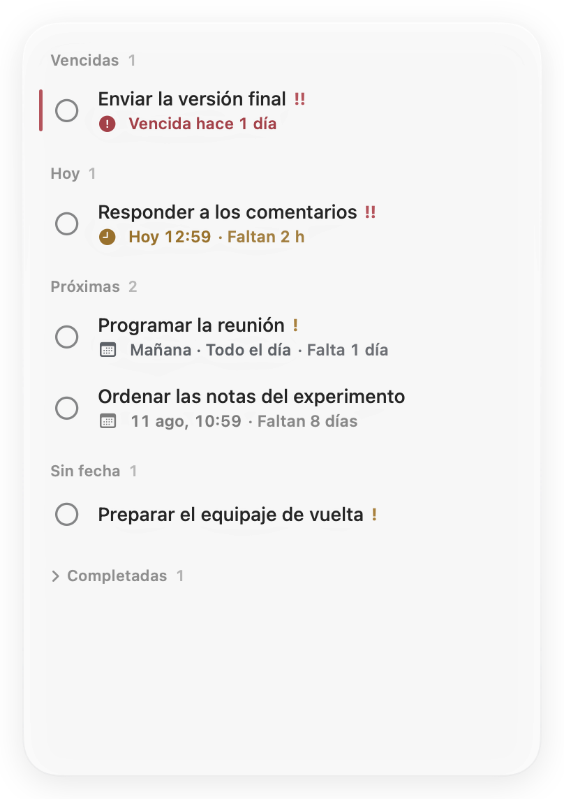
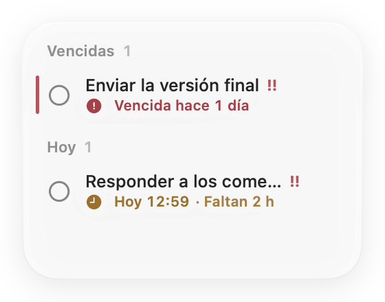
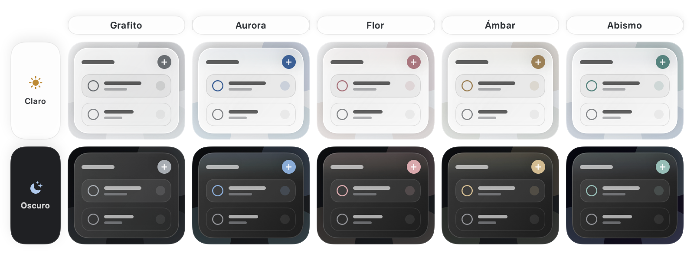

<p align="center">
  <a href="README.md">English</a> ·
  <a href="README.zh-Hans.md">简体中文</a> ·
  <a href="README.zh-Hant.md">繁體中文</a> ·
  <a href="README.ja.md">日本語</a> ·
  <a href="README.ko.md">한국어</a> ·
  <a href="README.fr.md">Français</a> ·
  <a href="README.es.md">Español</a> ·
  <a href="README.de.md">Deutsch</a>
</p>

<p align="center">
  
</p>

<h1 align="center">Jotted</h1>

<p align="center"><strong>Lo próximo, siempre a la vista y sin distracciones.</strong></p>

<p align="center">
  <a href="https://github.com/kaikaiyao/Jotted/releases/latest/download/Jotted-macOS.zip">
    
  </a>
</p>

<p align="center"><sub>Requiere macOS 14 o posterior · Apple Silicon e Intel · <a href="https://github.com/kaikaiyao/Jotted/releases">Todas las versiones</a></sub></p>

<p align="center">
  
</p>

Jotted es un tablero de tareas ligero y nativo para macOS. Su nueva interfaz centrada en el contenido elimina las tarjetas innecesarias y conserva solo lo útil: tareas, fechas límite, cuentas atrás e indicadores discretos. Permanece en una esquina del escritorio y, al reducir la ventana, se simplifica automáticamente hasta dejar lo esencial.

### Instalación

Descarga y descomprime el ZIP, y mueve `Jotted.app` a Aplicaciones.

> **Primer inicio:** Apple aún no ha notarizado Jotted. Si macOS la bloquea, intenta abrirla primero y luego selecciona **Abrir igualmente** en **Ajustes del Sistema → Privacidad y seguridad**.

## Por qué Jotted

| Sereno desde el principio | Rápido cuando hace falta | Solo tuyo |
|---|---|---|
| Sin barra superior, paneles recargados ni tarjetas pesadas. | Haz clic derecho en cualquier espacio vacío o pulsa `⌘N` para anotar una tarea. | Sin cuentas, sincronización en la nube, analítica ni conexiones externas. |

## Así funciona

### Un tablero para cualquier tamaño

Redimensiona la ventana desde cualquier borde o esquina. Jotted cambia automáticamente a una vista compacta y recupera el tablero completo al ampliarla. El editor se abre en su propia ventana, sin mover ni agrandar el tablero principal.

<table align="center">
  <tr>
    <td align="center" valign="middle"></td>
    <td align="center" valign="middle"></td>
  </tr>
  <tr>
    <td align="center"><sub>Tablero completo</sub></td>
    <td align="center"><sub>Vista compacta automática</sub></td>
  </tr>
</table>

### Un acabado de cristal que encaja con tu escritorio

Elige Grafito, Aurora, Flor, Ámbar o Abismo. Todos mantienen el cristal neutro y reservan el color poco saturado para los controles, los estados y un breve resplandor del borde, de modo que parezca formar parte del cristal en vez de cubrirlo. La transparencia se ajusta de forma continua y el valor predeterminado es 50 %. En macOS 26, Jotted usa Liquid Glass nativo; en macOS 14–25, un material translúcido cuidadosamente adaptado. Los modos claro y oscuro están plenamente integrados.

<p align="center">
  
</p>

### Fechas sin complicaciones

Usa una fecha límite de todo el día cuando solo importe la fecha, o añade una hora concreta cuando necesites precisión. Jotted agrupa automáticamente las tareas vencidas, de hoy, próximas, sin fecha y completadas. Al pulsar una tarea se abre un editor independiente, por lo que el tablero nunca cambia de tamaño mientras trabajas.

### En tu idioma

Sigue el idioma del sistema o elige chino simplificado, chino tradicional, inglés, japonés, coreano, francés, español o alemán. La interfaz cambia al instante y los formatos de fecha y hora se adaptan a la configuración regional.

## Funciones principales

- Fechas límite de todo el día o con hora exacta y un calendario diseñado a medida
- Cuenta atrás inteligente que cambia entre minutos, horas y días naturales
- Prioridad baja, media o alta, contadores de sección compactos y una fina marca de vencimiento
- Editor independiente que nunca redimensiona el tablero principal
- Cambio automático entre las vistas completa y compacta
- Cinco temas de acento sobrio y control continuo de la transparencia
- Liquid Glass nativo en macOS 26 y una alternativa refinada en macOS 14–25
- Apariencia clara u oscura, idioma y formatos de fecha y hora adaptados al sistema
- Opción de mantener la ventana al frente y control desde la barra de menús
- Apertura al iniciar sesión activada por defecto, con restauración de tamaño y posición
- Guardado local automático y sección de tareas completadas plegable

## Primeros pasos

1. Haz clic derecho en cualquier espacio vacío del tablero, o pulsa `⌘N`, para añadir una tarea.
2. Pulsa una tarea para editarla en una ventana aparte, o haz clic derecho para ver acciones rápidas.
3. Arrastra el título de una sección o un espacio vacío para mover el tablero; arrastra cualquier borde o esquina para cambiar su tamaño.

Abre Ajustes con `⌘,`. El icono de la barra de menús permite mostrar u ocultar el tablero incluso después de cerrar su ventana.

## Privacidad

Jotted no tiene cuentas, sincronización en la nube, analítica ni conexiones externas. Tus tareas se guardan únicamente en este Mac:

```text
~/Library/Application Support/Jotted/board.json
```

## Compilar desde el código fuente

Requiere macOS 14 o posterior, Xcode con Swift 6 y [XcodeGen](https://github.com/yonaskolb/XcodeGen).

```bash
brew install xcodegen
./Packaging/build-app.sh
open "dist/Jotted.app"
```

El script genera `dist/Jotted.app` y `dist/Jotted-macOS.zip`.

<details>
<summary>Ejecutar las pruebas</summary>

```bash
swift test --parallel
```

</details>

---

<p align="center"><sub>Creado con SwiftUI y AppKit para un escritorio Mac más sereno.</sub></p>

<!-- Sync facts: macOS 14+, 8 UI languages plus Follow System, 5 themes, Cmd-N, Cmd-comma, local data path. -->
