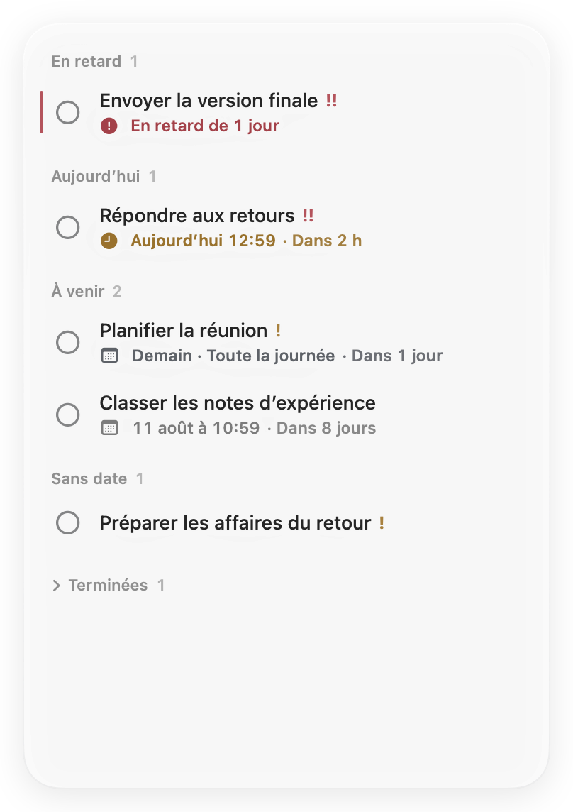
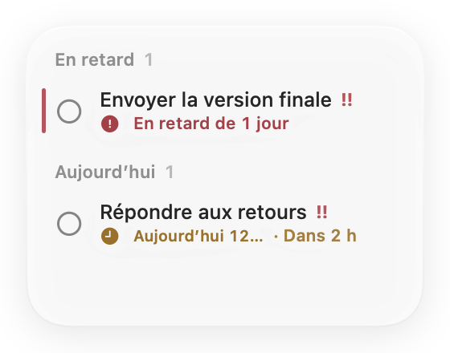
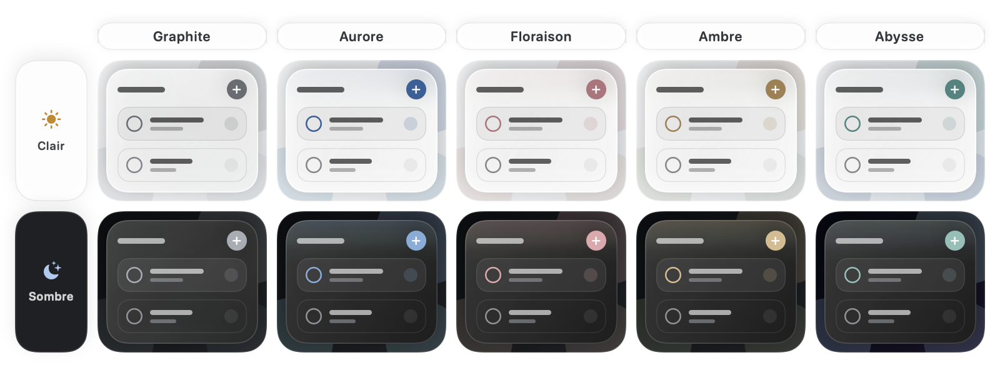

<p align="center">
  <a href="README.md">English</a> ·
  <a href="README.zh-Hans.md">简体中文</a> ·
  <a href="README.zh-Hant.md">繁體中文</a> ·
  <a href="README.ja.md">日本語</a> ·
  <a href="README.ko.md">한국어</a> ·
  <a href="README.fr.md">Français</a> ·
  <a href="README.es.md">Español</a> ·
  <a href="README.de.md">Deutsch</a>
</p>

<p align="center">
  
</p>

<h1 align="center">Jotted</h1>

<p align="center"><strong>La suite, posée discrètement sur votre bureau.</strong></p>

<p align="center">
  <a href="https://github.com/kaikaiyao/Jotted/releases/latest/download/Jotted-macOS.zip">
    
  </a>
</p>

<p align="center"><sub>macOS 14 ou version ultérieure · Apple Silicon et Intel · <a href="https://github.com/kaikaiyao/Jotted/releases">Toutes les versions</a></sub></p>

<p align="center">
  
</p>

Jotted est un tableau de tâches natif et léger pour macOS. Sa nouvelle interface centrée sur le contenu supprime les cartes superflues pour ne garder que l’utile : tâches, échéances, comptes à rebours et repères d’état discrets. Il reste dans un coin du bureau et se recentre automatiquement sur l’essentiel lorsque vous réduisez la fenêtre.

### Installation

Téléchargez et décompressez le ZIP, puis placez `Jotted.app` dans Applications.

> **Premier lancement :** L’app Jotted n’a pas encore été notariée par Apple. Si macOS la bloque, essayez d’abord de l’ouvrir, puis choisissez **Ouvrir quand même** dans **Réglages Système → Confidentialité et sécurité**.

## Pourquoi Jotted

| Calme par défaut | Rapide au bon moment | Rien qu’à vous |
|---|---|---|
| Sans barre d’outils, tableau de bord ni cartes pesantes. | Faites un clic droit dans une zone vide ou appuyez sur `⌘N` pour noter une tâche. | Aucun compte, aucune synchronisation dans le cloud, aucune analyse d’utilisation ni requête réseau externe. |

## Découvrez-le en images

### Un tableau, toutes les tailles

Redimensionnez-le depuis n’importe quel bord ou coin. Quand la fenêtre rétrécit, Jotted passe automatiquement à une disposition compacte, puis rétablit le tableau complet lorsque vous l’agrandissez. L’éditeur de tâche s’ouvre dans sa propre fenêtre, sans déplacer ni agrandir le tableau.

<table align="center">
  <tr>
    <td align="center" valign="middle"></td>
    <td align="center" valign="middle"></td>
  </tr>
  <tr>
    <td align="center"><sub>Tableau complet</sub></td>
    <td align="center"><sub>Vue compacte automatique</sub></td>
  </tr>
</table>

### Un effet de verre qui s’accorde à votre bureau

Choisissez Graphite, Aurore, Floraison, Ambre ou Abysse. Chaque thème conserve un verre neutre et réserve sa couleur peu saturée aux commandes, aux repères d’état et à une courte lueur de bord : la couleur semble vivre dans le verre plutôt que le recouvrir. La transparence se règle en continu, avec 50 % par défaut. Sous macOS 26, Jotted utilise le Liquid Glass natif ; sous macOS 14 à 25, un matériau translucide soigneusement assorti. Les apparences claire et sombre sont prises en charge.

<p align="center">
  
</p>

### Une date, avec ou sans heure

Choisissez une échéance « Toute la journée » lorsque seule la date compte, ou ajoutez une heure précise lorsque c’est nécessaire. Jotted classe automatiquement les tâches en retard, prévues aujourd’hui, à venir, sans date et terminées. Cliquez sur une tâche pour l’ouvrir dans un éditeur dédié : le tableau conserve toujours sa taille.

### Dans votre langue

Suivez la langue du système ou choisissez le chinois simplifié, le chinois traditionnel, l’anglais, le japonais, le coréen, le français, l’espagnol ou l’allemand. L’interface se met à jour immédiatement et les dates comme les heures restent adaptées aux conventions locales.

## Points forts

- Calendrier moderne conçu pour les échéances avec ou sans heure précise
- Compte à rebours intelligent passant naturellement des minutes aux heures puis aux jours calendaires
- Priorités basse, moyenne et haute, compteurs de section compacts et fin repère de retard
- Fenêtre d’édition indépendante qui ne redimensionne jamais le tableau principal
- Passage automatique entre les dispositions complète et compacte
- Cinq thèmes aux accents sobres et réglage continu de la transparence
- Liquid Glass natif sous macOS 26 et alternative raffinée sous macOS 14 à 25
- Apparences claire et sombre, langue, dates et heures adaptées au système
- Option de maintien au premier plan et commandes depuis la barre des menus
- Ouverture à la connexion activée par défaut, avec restauration de la dernière position et de la dernière taille
- Enregistrement local automatique et section des tâches terminées repliable

## Premiers pas

1. Faites un clic droit dans une zone vide du tableau, ou appuyez sur `⌘N`, pour ajouter une tâche.
2. Cliquez sur une tâche pour la modifier dans une fenêtre séparée, ou faites un clic droit pour les actions rapides.
3. Faites glisser un titre de section ou une zone vide pour déplacer le tableau ; faites glisser n’importe quel bord ou coin pour le redimensionner.

Appuyez sur `⌘,` pour ouvrir les Réglages. L’icône de la barre des menus permet d’afficher ou de masquer le tableau, même après la fermeture de sa fenêtre.

## Confidentialité

Jotted ne comporte aucun compte, aucune synchronisation dans le cloud, aucune analyse d’utilisation ni requête réseau externe. Vos tâches sont enregistrées uniquement sur ce Mac, à l’emplacement suivant :

```text
~/Library/Application Support/Jotted/board.json
```

## Compiler depuis les sources

Nécessite macOS 14 ou une version ultérieure, Xcode avec Swift 6 et [XcodeGen](https://github.com/yonaskolb/XcodeGen).

```bash
brew install xcodegen
./Packaging/build-app.sh
open "dist/Jotted.app"
```

Le script de compilation produit à la fois `dist/Jotted.app` et `dist/Jotted-macOS.zip`.

<details>
<summary>Exécuter la suite de tests</summary>

```bash
swift test --parallel
```

</details>

---

<p align="center"><sub>Conçu avec SwiftUI et AppKit pour un bureau Mac plus serein.</sub></p>

<!-- Sync facts: macOS 14+, 8 UI languages plus Follow System, 5 themes, Cmd-N, Cmd-comma, local data path. -->
