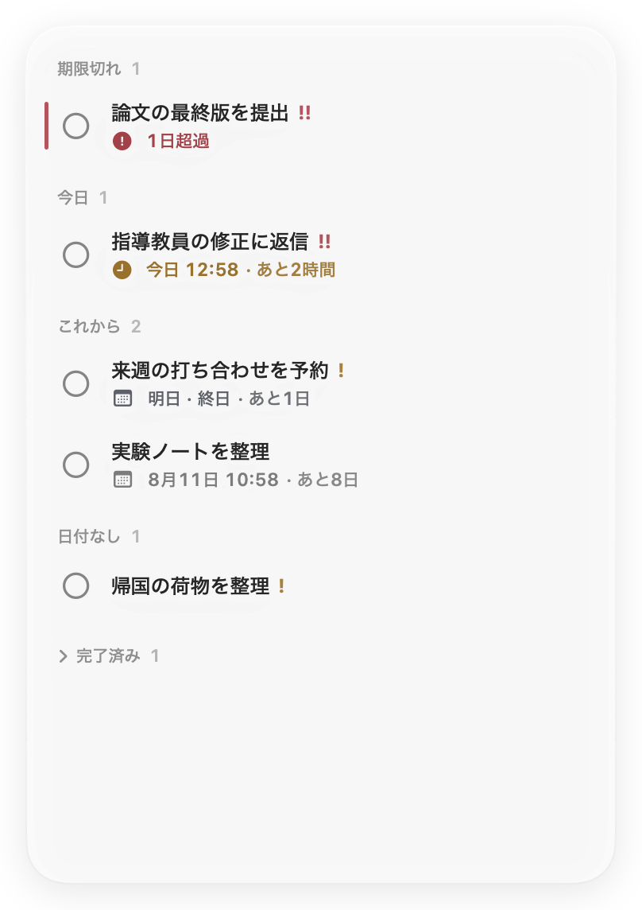
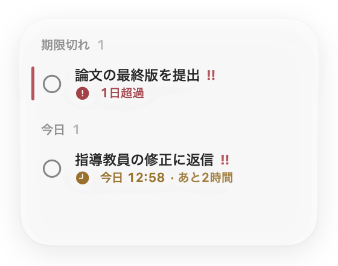
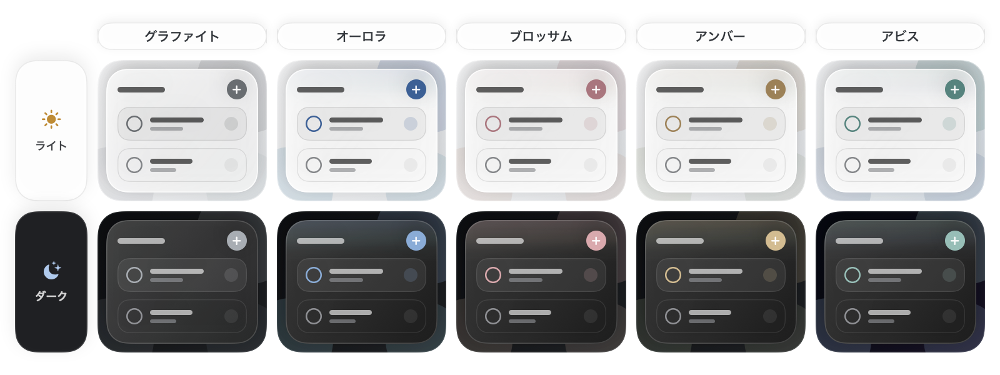

<p align="center">
  <a href="README.md">English</a> ·
  <a href="README.zh-Hans.md">简体中文</a> ·
  <a href="README.zh-Hant.md">繁體中文</a> ·
  <a href="README.ja.md">日本語</a> ·
  <a href="README.ko.md">한국어</a> ·
  <a href="README.fr.md">Français</a> ·
  <a href="README.es.md">Español</a> ·
  <a href="README.de.md">Deutsch</a>
</p>

<p align="center">
  
</p>

<h1 align="center">Jotted</h1>

<p align="center"><strong>次にやることを、デスクトップにそっと置く。</strong></p>

<p align="center">
  <a href="https://github.com/kaikaiyao/Jotted/releases/latest/download/Jotted-macOS.zip">
    
  </a>
</p>

<p align="center"><sub>macOS 14以降 · Appleシリコン／Intel対応 · <a href="https://github.com/kaikaiyao/Jotted/releases">すべてのバージョン</a></sub></p>

<p align="center">
  
</p>

Jotted は、macOS ネイティブの軽量なデスクトップ ToDo ボードです。新しいコンテンツ中心の画面はカードの枠を取り払い、タスク、期限、カウントダウン、控えめな状態表示だけを残しました。デスクトップの片隅に静かに佇み、ウインドウを小さくすると表示は自動的に要点だけに切り替わります。

### インストール

ZIPをダウンロードして展開し、`Jotted.app`を「アプリケーション」フォルダへ移動します。

> **初回起動：** Jotted は現在、Appleの公証を受けていません。macOSにブロックされた場合は、まずアプリを開いてから、**システム設定 → プライバシーとセキュリティ**で**このまま開く**を選択してください。

## Jotted を選ぶ理由

| 静かな佇まい | すぐに書ける | データは自分のもの |
|---|---|---|
| ツールバー、ダッシュボード、重いカード装飾はありません。 | 空白部分を右クリックするか `⌘N` を押すだけで、すぐにタスクを追加できます。 | アカウント、クラウド同期、アクセス解析、外部への通信はありません。 |

## Jotted の使い心地

### ひとつのボードを、好きなサイズで

どの辺や角からでもドラッグしてサイズを変更できます。小さくすると自動的にコンパクト表示へ切り替わり、広げるとフル表示に戻ります。タスクエディタは別ウインドウで開くため、編集中にメインボードの大きさが変わることもありません。

<table align="center">
  <tr>
    <td align="center" valign="middle"></td>
    <td align="center" valign="middle"></td>
  </tr>
  <tr>
    <td align="center"><sub>フル表示</sub></td>
    <td align="center"><sub>自動コンパクト表示</sub></td>
  </tr>
</table>

### デスクトップになじむガラスデザイン

グラファイト、オーロラ、ブロッサム、アンバー、アビスの5つのテーマから選べます。どのテーマもガラス面はニュートラルに保ち、低彩度のアクセントを操作部、状態表示、短いエッジの光にだけ使います。色が塗装ではなくガラスの一部として感じられる設計です。透明度は連続的に調整でき、50%が初期設定です。macOS 26ではネイティブのLiquid Glassを、macOS 14〜25では外観を合わせた半透明素材を使用します。ライトとダークの両方に対応しています。

<p align="center">
  
</p>

### 日付だけでも、時刻まででも

その日までに終わればよいタスクには終日の期限を、時刻まで決めたいタスクには具体的な時間を設定できます。Jotted は期限切れ、今日、今後、日付なし、完了済みのタスクを自動で整理します。タスクをクリックすると専用エディタが別ウインドウで開くため、メインボードはそのままです。

### 使い慣れた言語で

システム設定に従うほか、簡体字中国語、繁体字中国語、英語、日本語、韓国語、フランス語、スペイン語、ドイツ語から選べます。切り替えはすぐに反映され、日付と時刻の形式も選択した言語環境に合わせて表示されます。

## 主な機能

- 専用設計のモダンな月間カレンダーと、終日／時刻指定の期限
- 残り時間に応じて分・時間・暦日を自然に切り替えるスマートカウントダウン
- 低・中・高の優先度、コンパクトな件数表示、細い期限切れマーカー
- メインボードのサイズを変えない独立したタスク編集ウインドウ
- フル表示とコンパクト表示の自動切り替え
- 控えめなアクセントを持つ5つのテーマと、連続的な透明度調整
- macOS 26のネイティブLiquid Glassと、macOS 14〜25向けの洗練された代替素材
- システムに合わせたライト／ダーク外観、言語、日付、時刻形式
- 最前面表示の切り替えと、メニューバーからの操作
- ログイン時に自動起動し、前回の位置とサイズを復元（初期設定で有効）
- ローカルへの自動保存と、折りたためる完了済みセクション

## はじめ方

1. ボードの空白部分を右クリックするか `⌘N` を押して、タスクを追加します。
2. タスクをクリックして別ウインドウで編集するか、右クリックでクイック操作を開きます。
3. セクション見出しまたは空白部分をドラッグしてボードを移動し、辺や角をドラッグしてサイズを変更します。

設定は `⌘,` で開けます。ボードのウインドウを閉じた後も、メニューバーのアイコンから再表示できます。

## プライバシー

Jotted には、アカウント、クラウド同期、アクセス解析、外部へのネットワーク通信がありません。タスクはこの Mac の次の場所にだけ保存されます。

```text
~/Library/Application Support/Jotted/board.json
```

## ソースからビルド

macOS 14 以降、Swift 6 に対応した Xcode、および [XcodeGen](https://github.com/yonaskolb/XcodeGen) が必要です。

```bash
brew install xcodegen
./Packaging/build-app.sh
open "dist/Jotted.app"
```

ビルドスクリプトによって `dist/Jotted.app` と `dist/Jotted-macOS.zip` が生成されます。

<details>
<summary>テストを実行</summary>

```bash
swift test --parallel
```

</details>

---

<p align="center"><sub>SwiftUI と AppKit で、Mac のデスクトップを少し穏やかに。</sub></p>

<!-- Sync facts: macOS 14+, 8 UI languages plus Follow System, 5 themes, Cmd-N, Cmd-comma, local data path. -->
