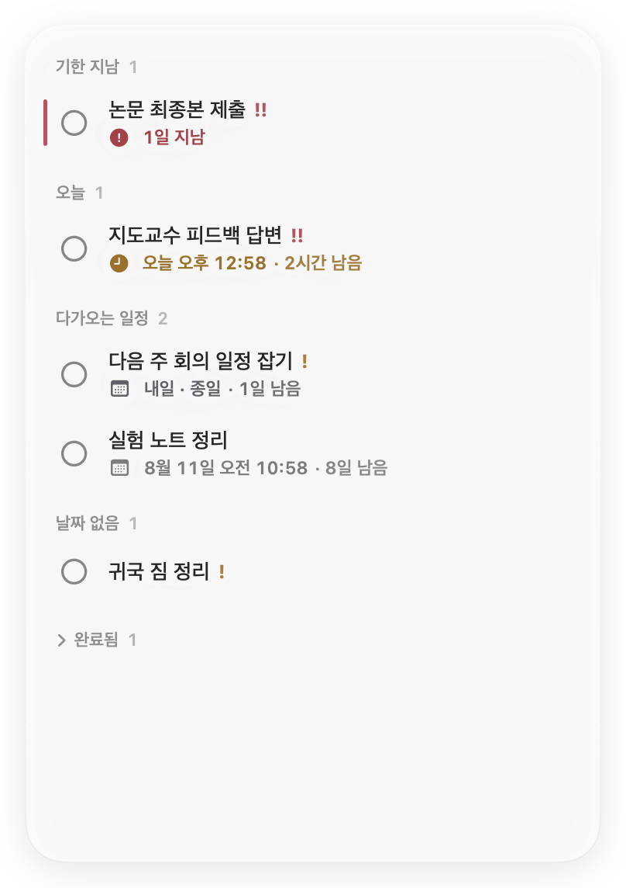
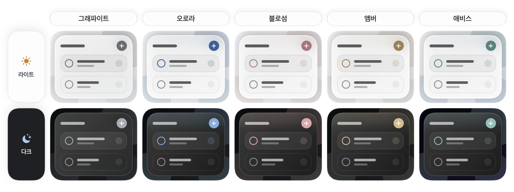

<p align="center">
  <a href="README.md">English</a> ·
  <a href="README.zh-Hans.md">简体中文</a> ·
  <a href="README.zh-Hant.md">繁體中文</a> ·
  <a href="README.ja.md">日本語</a> ·
  <a href="README.ko.md">한국어</a> ·
  <a href="README.fr.md">Français</a> ·
  <a href="README.es.md">Español</a> ·
  <a href="README.de.md">Deutsch</a>
</p>

<p align="center">
  
</p>

<h1 align="center">Jotted</h1>

<p align="center"><strong>다음 할 일을, 데스크톱 위에 가볍게.</strong></p>

<p align="center">
  <a href="https://github.com/kaikaiyao/Jotted/releases/latest/download/Jotted-macOS.zip">
    
  </a>
</p>

<p align="center"><sub>macOS 14 이상 · Apple Silicon 및 Intel 지원 · <a href="https://github.com/kaikaiyao/Jotted/releases">모든 버전</a></sub></p>

<p align="center">
  
</p>

Jotted은 macOS를 위한 가볍고 네이티브한 데스크톱 할 일 보드입니다. 새 콘텐츠 중심 화면은 카드 장식을 걷어내고 할 일, 마감일, 카운트다운, 절제된 상태 표시만 남겼습니다. 데스크톱 한쪽에 조용히 머물며, 창을 줄이면 꼭 필요한 정보만 남도록 자동으로 간결해집니다.

### 설치

ZIP을 다운로드해 압축을 푼 뒤 `Jotted.app`을 응용 프로그램 폴더로 옮기세요.

> **첫 실행:** Jotted은 현재 Apple 공증을 받지 않았습니다. macOS가 실행을 차단하면 먼저 앱을 열어 본 다음, **시스템 설정 → 개인정보 보호 및 보안**에서 **그래도 열기**를 선택하세요.

## Jotted을 선택하는 이유

| 기본부터 차분하게 | 필요할 때는 빠르게 | 온전히 나만의 데이터 |
|---|---|---|
| 도구 막대, 대시보드, 무거운 카드 장식이 없습니다. | 빈 곳을 우클릭하거나 `⌘N`을 눌러 바로 할 일을 기록하세요. | 계정, 클라우드 동기화, 사용 분석, 외부 네트워크 요청이 없습니다. |

## 직접 살펴보기

### 하나의 보드, 어떤 크기에서도

어느 가장자리나 모서리에서든 크기를 조절할 수 있습니다. 창이 작아지면 Jotted이 자동으로 간결한 레이아웃으로 전환하고, 다시 키우면 전체 보드로 돌아옵니다. 별도의 할 일 편집기를 열어도 보드가 움직이거나 커지지 않습니다.

<table align="center">
  <tr>
    <td align="center" valign="middle"></td>
    <td align="center" valign="middle"></td>
  </tr>
  <tr>
    <td align="center"><sub>전체 보드</sub></td>
    <td align="center"><sub>자동 간결 모드</sub></td>
  </tr>
</table>

### 데스크톱에 자연스럽게 스며드는 글래스 디자인

그래파이트, 오로라, 블로섬, 앰버, 애비스의 다섯 가지 테마 중에서 선택하세요. 모든 테마는 유리 표면을 중립적으로 유지하고, 저채도 강조색을 컨트롤과 상태 표시, 짧은 가장자리 빛에만 사용합니다. 색이 위에 칠해진 것이 아니라 유리 안에 머무는 느낌입니다. 투명도는 연속적으로 조절할 수 있으며 기본값은 50%입니다. macOS 26에서는 네이티브 Liquid Glass를, macOS 14~25에서는 세심하게 맞춘 반투명 소재를 사용합니다. 라이트와 다크 모드를 모두 지원합니다.

<p align="center">
  
</p>

### 날짜만으로 충분할 때, 시간까지 필요할 때

날짜만 중요하다면 종일 마감일을 지정하고, 정확한 일정이 필요할 때만 시간을 추가하세요. Jotted은 기한 지남, 오늘, 다가오는 일정, 날짜 없음, 완료됨 항목을 자동으로 정리합니다. 할 일을 클릭하면 전용 편집기가 별도 창으로 열리므로 보드 크기는 그대로 유지됩니다.

### 익숙한 언어로

시스템 언어를 따르거나 중국어 간체, 중국어 번체, 영어, 일본어, 한국어, 프랑스어, 스페인어, 독일어 중에서 직접 선택할 수 있습니다. 인터페이스는 즉시 바뀌고 날짜와 시간 형식은 선택한 언어 환경에 맞게 표시됩니다.

## 주요 기능

- 종일 및 특정 시간 마감일을 지원하는 맞춤형 현대식 캘린더
- 남은 시간에 따라 분·시간·일 단위로 자연스럽게 바뀌는 스마트 카운트다운
- 낮음, 보통, 높음의 세 가지 우선순위, 간결한 섹션 수, 얇은 기한 초과 표시
- 메인 보드 크기에 영향을 주지 않는 별도의 할 일 편집 창
- 전체 및 간결 레이아웃 자동 전환
- 절제된 강조색 테마 다섯 가지와 연속형 투명도 조절
- macOS 26 네이티브 Liquid Glass와 macOS 14~25용 정교한 대체 소재
- 시스템 설정을 따르는 라이트·다크 모드, 언어, 날짜 및 시간 형식
- 선택 가능한 항상 위에 표시 기능과 메뉴 막대 제어
- 로그인 시 열기 기본 활성화 및 마지막 창 위치·크기 복원
- 로컬 자동 저장과 접을 수 있는 완료 항목

## 시작하기

1. 보드의 빈 곳을 우클릭하거나 `⌘N`을 눌러 할 일을 추가합니다.
2. 할 일을 클릭해 별도 창에서 편집하거나, 우클릭해 빠른 작업을 엽니다.
3. 섹션 제목이나 빈 곳을 드래그해 보드를 옮기고, 가장자리나 모서리를 드래그해 크기를 조절합니다.

`⌘,`을 눌러 설정을 여세요. 보드 창을 닫은 뒤에도 메뉴 막대 아이콘으로 다시 표시하거나 숨길 수 있습니다.

## 개인정보 보호

Jotted에는 계정 시스템, 클라우드 동기화, 사용 분석, 외부 네트워크 요청이 없습니다. 할 일은 이 Mac의 다음 위치에만 저장됩니다.

```text
~/Library/Application Support/Jotted/board.json
```

## 소스에서 빌드하기

macOS 14 이상, Swift 6을 지원하는 Xcode, [XcodeGen](https://github.com/yonaskolb/XcodeGen)이 필요합니다.

```bash
brew install xcodegen
./Packaging/build-app.sh
open "dist/Jotted.app"
```

빌드 스크립트는 `dist/Jotted.app`과 `dist/Jotted-macOS.zip`을 함께 생성합니다.

<details>
<summary>테스트 모음 실행</summary>

```bash
swift test --parallel
```

</details>

---

<p align="center"><sub>더 차분한 Mac 데스크톱을 위해 SwiftUI와 AppKit으로 만들었습니다.</sub></p>

<!-- Sync facts: macOS 14+, 8 UI languages plus Follow System, 5 themes, Cmd-N, Cmd-comma, local data path. -->
