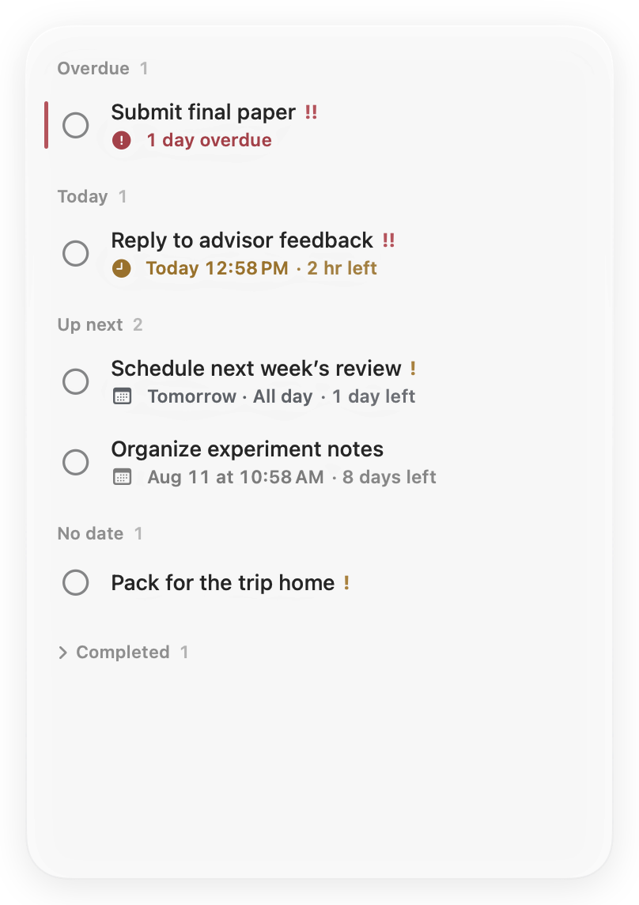
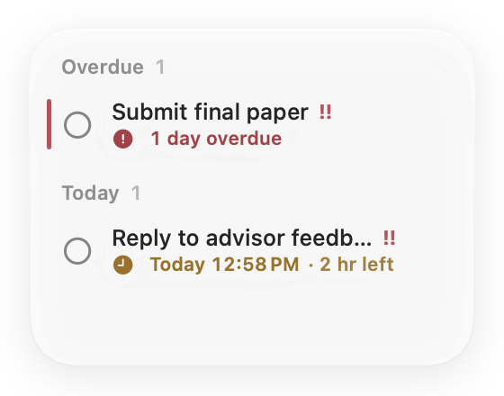
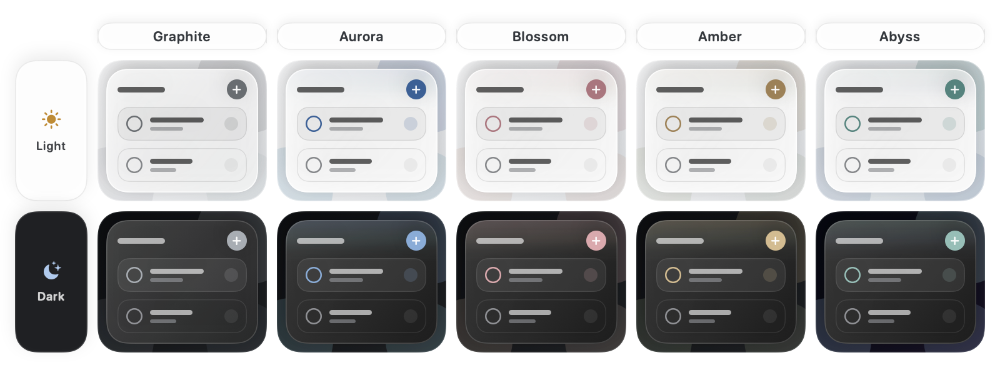

<p align="center">
  <a href="README.md">English</a> ·
  <a href="README.zh-Hans.md">简体中文</a> ·
  <a href="README.zh-Hant.md">繁體中文</a> ·
  <a href="README.ja.md">日本語</a> ·
  <a href="README.ko.md">한국어</a> ·
  <a href="README.fr.md">Français</a> ·
  <a href="README.es.md">Español</a> ·
  <a href="README.de.md">Deutsch</a>
</p>

<p align="center">
  
</p>

<h1 align="center">Jotted</h1>

<p align="center"><strong>A quiet place for what’s next.</strong></p>

<p align="center">
  <a href="https://github.com/kaikaiyao/Jotted/releases/latest/download/Jotted-macOS.zip">
    
  </a>
</p>

<p align="center"><sub>Requires macOS 14 or later · Apple silicon and Intel · <a href="https://github.com/kaikaiyao/Jotted/releases">All versions</a></sub></p>

<p align="center">
  
</p>

Jotted is a lightweight, native to-do board that lives quietly on your Mac desktop. Its new content-first interface removes card chrome and keeps only what helps you act: tasks, deadlines, countdowns, and restrained status cues. Make the window smaller and the board automatically pares itself down to the essentials.

### Install

Download and unzip the ZIP, then move `Jotted.app` to Applications.

> **First launch:** Jotted is not yet notarized by Apple. If macOS blocks it, first try opening the app, then go to **System Settings → Privacy & Security** and choose **Open Anyway**.

## Why Jotted

| Calm by default | Fast when needed | Yours only |
|---|---|---|
| No toolbar, dashboard, or heavy task cards. | Right-click any blank area or press `⌘N` to capture a task. | No account, cloud sync, analytics, or external network requests. |

## See it in action

### One board, any size

Resize from any edge or corner. Jotted switches to a compact layout automatically, then restores the full board as the window grows—without moving or enlarging itself when the separate task editor opens.

<table align="center">
  <tr>
    <td align="center" valign="middle"></td>
    <td align="center" valign="middle"></td>
  </tr>
  <tr>
    <td align="center"><sub>Full board</sub></td>
    <td align="center"><sub>Automatic compact view</sub></td>
  </tr>
</table>

### Glass that fits your desktop

Choose Graphite, Aurora, Blossom, Amber, or Abyss. Every theme keeps the surface neutral and lets a low-chroma accent live in the controls, status marks, and a short edge glow, so color feels part of the glass instead of paint on top of it. Fine-tune transparency continuously; 50% is the balanced default. On macOS 26, Jotted uses native Liquid Glass, with a carefully matched translucent material on macOS 14–25. Light and dark appearances are both supported.

<p align="center">
  
</p>

### Dates without ceremony

Give a task an all-day deadline when the date is all that matters, or attach an exact time when it is not. Jotted groups overdue, today, upcoming, undated, and completed tasks automatically. Clicking a task opens a focused editor in its own window, so the board never changes size underneath you.

### At home in your language

Follow the system language or choose Simplified Chinese, Traditional Chinese, English, Japanese, Korean, French, Spanish, or German. The interface updates immediately, while date and time formatting remain locale-aware.

## Highlights

- All-day and exact-time deadlines with a purpose-built calendar
- Smart countdowns that switch naturally between minutes, hours, and calendar days
- Low, medium, and high priorities, compact section counts, and a slim overdue marker
- Independent task editor that never resizes the main board
- Automatic full and compact layouts
- Five restrained accent themes and continuous transparency control
- Native Liquid Glass on macOS 26, with a refined fallback on macOS 14–25
- System-aware light mode, dark mode, language, date, and time formatting
- Optional keep-on-top behavior and a menu bar control
- Open at login by default, with the last window position and size restored
- Automatic local persistence and a collapsible completed section

## Get started

1. Right-click any blank area of the board, or press `⌘N`, to add a task.
2. Click a task to edit it in a separate window, or right-click it for quick actions.
3. Drag a section heading or blank area to move the board; drag any edge or corner to resize it.

Open Settings with `⌘,`. The menu bar icon can show or hide the board even when its window is closed.

## Privacy

Jotted has no account system, cloud sync, analytics, or external network requests. Your tasks are stored only on this Mac at:

```text
~/Library/Application Support/Jotted/board.json
```

## Build from source

Requires macOS 14 or later, Xcode with Swift 6, and [XcodeGen](https://github.com/yonaskolb/XcodeGen).

```bash
brew install xcodegen
./Packaging/build-app.sh
open "dist/Jotted.app"
```

The build script produces both `dist/Jotted.app` and `dist/Jotted-macOS.zip`.

<details>
<summary>Run the test suite</summary>

```bash
swift test --parallel
```

</details>

---

<p align="center"><sub>Built with SwiftUI and AppKit for a calmer Mac desktop.</sub></p>

<!-- Sync facts: macOS 14+, 8 UI languages plus Follow System, 5 themes, Cmd-N, Cmd-comma, local data path. -->
