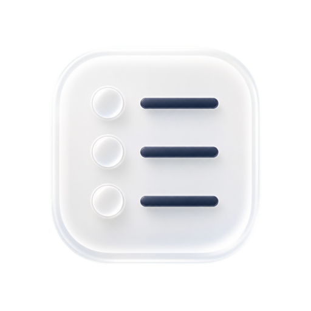
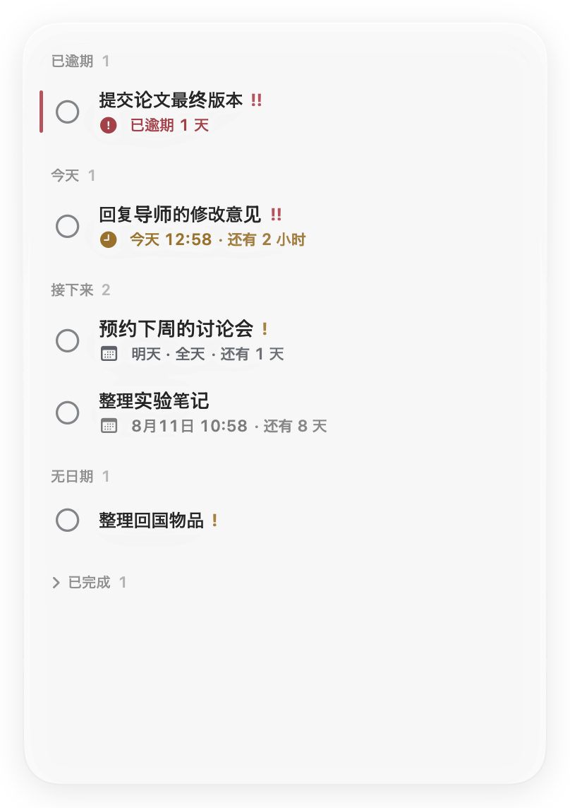
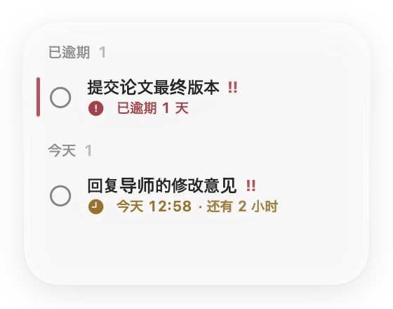
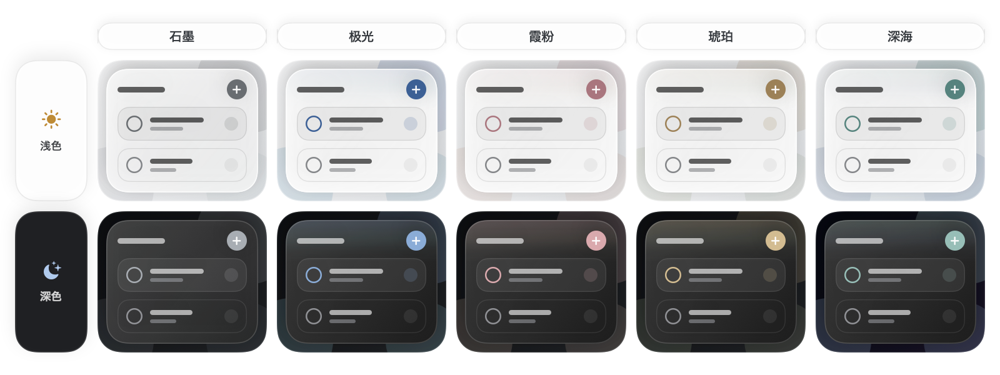

<p align="center">
  <a href="README.md">English</a> ·
  <a href="README.zh-Hans.md">简体中文</a> ·
  <a href="README.zh-Hant.md">繁體中文</a> ·
  <a href="README.ja.md">日本語</a> ·
  <a href="README.ko.md">한국어</a> ·
  <a href="README.fr.md">Français</a> ·
  <a href="README.es.md">Español</a> ·
  <a href="README.de.md">Deutsch</a>
</p>

<p align="center">
  
</p>

<h1 align="center">记着</h1>

<p align="center"><strong>把下一件事，轻轻放在桌面上。</strong></p>

<p align="center">
  <a href="https://github.com/kaikaiyao/Jotted/releases/latest/download/Jotted-macOS.zip">
    
  </a>
</p>

<p align="center"><sub>需要 macOS 14 或更高版本 · 支持 Apple 芯片与 Intel · <a href="https://github.com/kaikaiyao/Jotted/releases">全部版本</a></sub></p>

<p align="center">
  
</p>

记着是一款原生、轻量的 macOS 桌面待办看板。新版采用以内容为中心的无卡片界面，只留下真正有用的信息：事项、截止日期、倒计时与克制的状态提示。它安静地待在桌面一角；缩小窗口时，界面还会自动收敛到最必要的内容。

### 安装

下载并解压 ZIP，然后将 `Jotted.app` 移入“应用程序”。

> **首次打开：** Jotted 目前尚未经过 Apple 公证。如果 macOS 阻止打开，请先尝试启动应用，再前往**系统设置 → 隐私与安全性**，选择**仍要打开**。

## 为什么是记着

| 默认安静 | 随手就记 | 只属于你 |
|---|---|---|
| 没有顶栏、仪表盘或厚重的事项卡片。 | 右键任意空白位置，或按 `⌘N`，立即添加事项。 | 无账户、云同步、分析统计或外部网络请求。 |

## 看看它如何工作

### 一块看板，大小自如

从任意边缘或四角拖动即可缩放。窗口缩小时，记着会自动切换到简洁布局；放大后恢复完整看板。打开独立的事项编辑窗，也不会偷偷改变主看板大小。

<table align="center">
  <tr>
    <td align="center" valign="middle"></td>
    <td align="center" valign="middle"></td>
  </tr>
  <tr>
    <td align="center"><sub>完整看板</sub></td>
    <td align="center"><sub>自动简洁模式</sub></td>
  </tr>
</table>

### 与桌面相融的玻璃感

可选择石墨、极光、霞粉、琥珀或深海五套主题。所有主题都保留中性的玻璃底色，仅在控件、状态标记与边缘微光中加入低饱和强调色，让颜色像生长在玻璃里，而不是覆盖在上面的涂层。面板通透度可连续调节，50% 是默认平衡点；macOS 26 使用系统原生 Liquid Glass，macOS 14–25 则使用精心匹配的通透材质。浅色与深色外观均完整支持。

<p align="center">
  
</p>

### 日期可以简单，也可以精确

只需要知道哪天前完成时，就使用全天截止日期；需要精确安排时，再添加具体时间。记着会自动整理已逾期、今天、接下来、无日期和已完成事项。点击事项后，编辑器会在独立窗口中打开，主看板始终保持原样。

### 用你熟悉的语言

可跟随系统，也可选择简体中文、繁体中文、英文、日文、韩文、法文、西班牙文或德文。切换后界面会立即更新，日期与时间格式也会适配当前语言环境。

## 功能亮点

- 自研现代月历，同时支持全天和具体时间截止日期
- 智能倒计时，会根据剩余时间自动切换分钟、小时和自然日
- 低、中、高三档优先级、紧凑的分组数量与细线逾期标记
- 独立事项编辑窗口，不会撑大主看板
- 完整与简洁布局自动切换
- 五套克制的强调色主题与连续通透度调节
- macOS 26 原生 Liquid Glass，兼容 macOS 14–25 的精致通透材质
- 跟随系统的浅色/深色外观、语言、日期和时间格式
- 可选窗口置顶，并提供菜单栏控制
- 默认登录时自动打开，并恢复上次的位置和大小
- 本地自动保存与可收起的已完成事项

## 开始使用

1. 右键看板任意空白位置，或按 `⌘N`，添加事项。
2. 点击事项在独立窗口中编辑，或右键事项快速操作。
3. 拖动分组标题或空白处移动看板；拖动任意边缘或四角调整大小。

按 `⌘,` 打开设置。即使关闭看板窗口，也可以通过菜单栏图标再次显示。

## 隐私

记着没有账户系统、云同步、分析统计或外部网络请求。你的事项仅保存在这台 Mac：

```text
~/Library/Application Support/Jotted/board.json
```

## 从源码构建

需要 macOS 14 或更高版本、支持 Swift 6 的 Xcode，以及 [XcodeGen](https://github.com/yonaskolb/XcodeGen)。

```bash
brew install xcodegen
./Packaging/build-app.sh
open "dist/Jotted.app"
```

构建脚本会同时生成 `dist/Jotted.app` 和 `dist/Jotted-macOS.zip`。

<details>
<summary>运行测试</summary>

```bash
swift test --parallel
```

</details>

---

<p align="center"><sub>用 SwiftUI 与 AppKit 打造，让 Mac 桌面更安静一点。</sub></p>

<!-- Sync facts: macOS 14+, 8 UI languages plus Follow System, 5 themes, Cmd-N, Cmd-comma, local data path. -->
