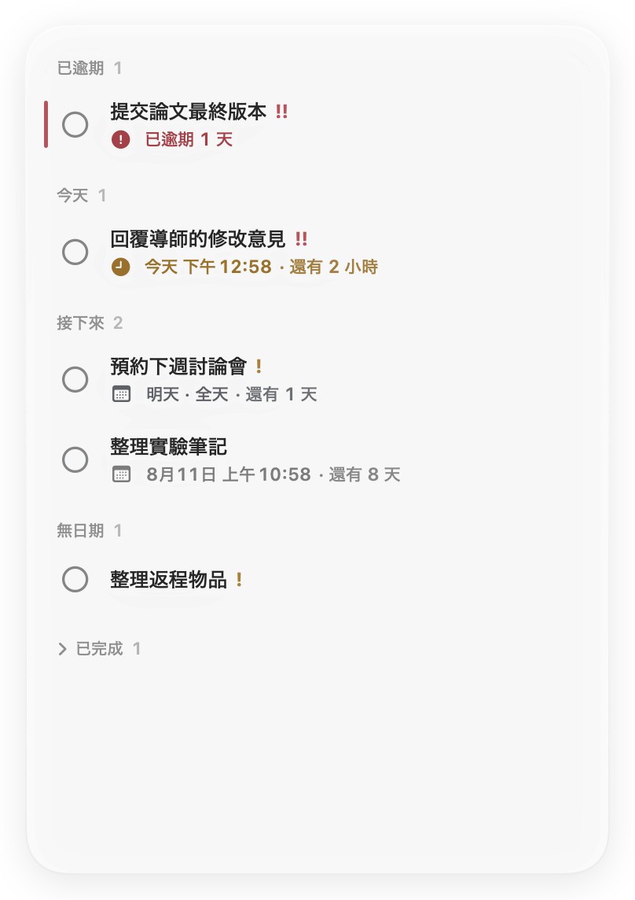
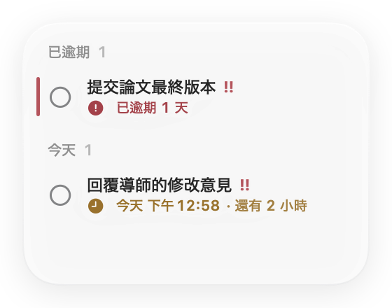
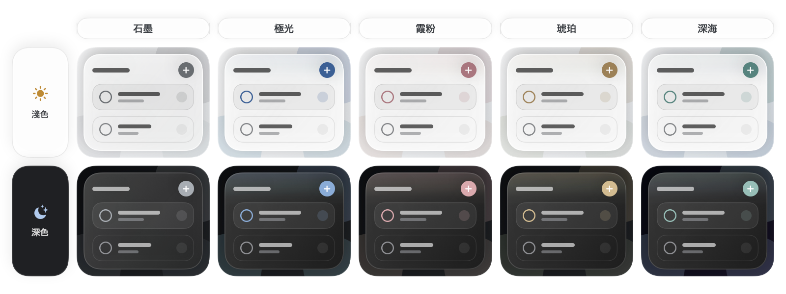

<p align="center">
  <a href="README.md">English</a> ·
  <a href="README.zh-Hans.md">简体中文</a> ·
  <a href="README.zh-Hant.md">繁體中文</a> ·
  <a href="README.ja.md">日本語</a> ·
  <a href="README.ko.md">한국어</a> ·
  <a href="README.fr.md">Français</a> ·
  <a href="README.es.md">Español</a> ·
  <a href="README.de.md">Deutsch</a>
</p>

<p align="center">
  
</p>

<h1 align="center">記著</h1>

<p align="center"><strong>把下一件事，輕輕放在桌面上。</strong></p>

<p align="center">
  <a href="https://github.com/kaikaiyao/Jotted/releases/latest/download/Jotted-macOS.zip">
    
  </a>
</p>

<p align="center"><sub>需要 macOS 14 或以上版本 · 支援 Apple 晶片與 Intel · <a href="https://github.com/kaikaiyao/Jotted/releases">所有版本</a></sub></p>

<p align="center">
  
</p>

記著是一款原生、輕量的 macOS 桌面待辦看板。新版採用以內容為中心的無卡片介面，只留下真正有用的資訊：事項、截止日期、倒數與克制的狀態提示。它安靜地待在桌面一角；縮小視窗時，介面還會自動精簡到最必要的內容。

### 安裝

下載並解壓縮 ZIP，然後將 `Jotted.app` 移入「應用程式」。

> **首次打開：** Jotted 目前尚未經過 Apple 公證。若 macOS 阻止打開，請先嘗試啟動 App，再前往**系統設定 → 隱私權與安全性**，選擇**強制打開**。

## 為什麼選擇記著

| 預設安靜 | 隨手就記 | 只屬於你 |
|---|---|---|
| 沒有工具列、儀表板或厚重的事項卡片。 | 在任意空白處按右鍵，或按 `⌘N`，立即新增事項。 | 無帳號、雲端同步、分析追蹤或外部網路請求。 |

## 看看它如何運作

### 一塊看板，大小自如

從任意邊緣或四角拖曳即可調整大小。視窗縮小時，記著會自動切換為精簡版面；放大後便恢復完整看板。事項編輯器會在獨立視窗中開啟，不會悄悄改變主看板的大小。

<table align="center">
  <tr>
    <td align="center" valign="middle"></td>
    <td align="center" valign="middle"></td>
  </tr>
  <tr>
    <td align="center"><sub>完整看板</sub></td>
    <td align="center"><sub>自動精簡模式</sub></td>
  </tr>
</table>

### 與桌面相融的玻璃質感

可選擇石墨、極光、霞粉、琥珀或深海五款主題。所有主題都保留中性的玻璃底色，只在控制項、狀態標記與邊緣微光中加入低飽和強調色，讓色彩像存在於玻璃裡，而不是覆蓋在上面的塗層。面板透明度可連續調整，50% 是預設平衡點；macOS 26 使用系統原生 Liquid Glass，macOS 14–25 則使用精心匹配的通透材質。淺色與深色外觀均完整支援。

<p align="center">
  
</p>

### 日期可以簡單，也可以精準

只需要知道哪天前完成時，就設定全天截止日期；需要精確安排時，再加入具體時間。記著會自動整理逾期、今天、接下來、無日期和已完成的事項。點選事項後，編輯器會在獨立視窗中開啟，主看板始終維持原樣。

### 用你熟悉的語言

可跟隨系統，也可選擇簡體中文、繁體中文、英文、日文、韓文、法文、西班牙文或德文。切換後介面會立即更新，日期與時間格式也會配合目前的語言環境。

## 功能亮點

- 專為記著設計的現代月曆，同時支援全天和具體時間截止日期
- 智慧倒數會依照剩餘時間，自動切換分鐘、小時和日曆日
- 低、中、高三種優先順序、精簡的分組數量與細線逾期標記
- 獨立事項編輯視窗，不會撐大主看板
- 完整與精簡版面自動切換
- 五款克制的強調色主題與連續透明度調整
- macOS 26 原生 Liquid Glass，兼容 macOS 14–25 的精緻通透材質
- 跟隨系統的淺色／深色外觀、語言、日期和時間格式
- 可選擇讓視窗保持最上層，並提供選單列控制
- 預設登入時自動開啟，並還原上次的位置和大小
- 自動儲存於本機，已完成事項亦可收合

## 開始使用

1. 在看板任意空白處按右鍵，或按 `⌘N`，新增事項。
2. 點選事項在獨立視窗中編輯，或按右鍵快速操作。
3. 拖曳分組標題或空白處來移動看板；拖曳任意邊緣或四角來調整大小。

按 `⌘,` 開啟設定。即使關閉看板視窗，也能透過選單列圖示再次顯示。

## 隱私

記著沒有帳號系統、雲端同步、分析追蹤或外部網路請求。你的事項只會保存在這台 Mac：

```text
~/Library/Application Support/Jotted/board.json
```

## 從原始碼建置

需要 macOS 14 或以上版本、支援 Swift 6 的 Xcode，以及 [XcodeGen](https://github.com/yonaskolb/XcodeGen)。

```bash
brew install xcodegen
./Packaging/build-app.sh
open "dist/Jotted.app"
```

建置腳本會同時產生 `dist/Jotted.app` 和 `dist/Jotted-macOS.zip`。

<details>
<summary>執行測試</summary>

```bash
swift test --parallel
```

</details>

---

<p align="center"><sub>以 SwiftUI 與 AppKit 打造，讓 Mac 桌面更安靜一些。</sub></p>

<!-- Sync facts: macOS 14+, 8 UI languages plus Follow System, 5 themes, Cmd-N, Cmd-comma, local data path. -->
